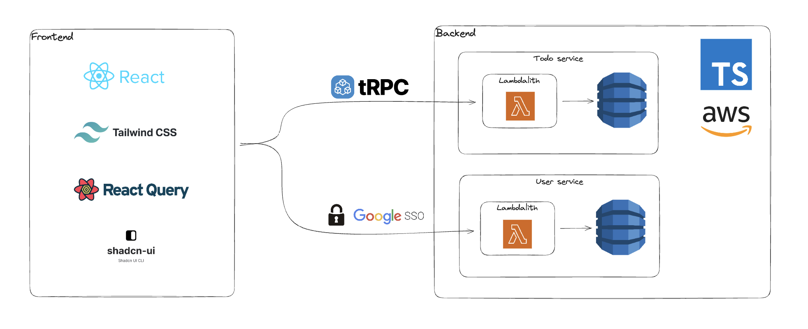

# Full Stack Project Starter

This is an opinionated repo to quickly bootstrap a scalable full-stack project. It features a backend and a frontend (React) both in Typescript, deployed on AWS through [SST](https://sst.dev/). Types are shared between frontend and backend thanks to [tRPC](https://trpc.io/docs/) library.

App is protected by a Google autentication.



It also include a strong eslint / prettier configuration for a better developer experience 🧑‍💻.

## Install

### Configure a google project for authentication

After completing the `Create a Google project` and `Add the authorize URL` sections of the [SST documentation](https://sst.dev/examples/how-to-add-google-login-to-your-sst-apps.html), you need to set your GOOGLE_CLIENT_ID secret. In your terminal:

- Run `npx sst secrets set GOOGLE_CLIENT_ID <Your Google client id> --stage <local and/or prod>`

### Live development setup

In your terminal:

- From `/`, run `pnpm dev`
- In AWS Dynamodb console, in your `local` stage table, create a user with the same Google email you want to login with:

  ```json
  {
    "email": {
      "S": "<Your Google Email>"
    },
    "firstName": {
      "S": "<Your first name>"
    },
    "id": {
      "S": "<Any uuid to get started with"
    },
    "lastName": {
      "S": "<Your last name>"
    },
    "_ct": {
      "S": "2024-04-09T10:39:47.766Z"
    },
    "_et": {
      "S": "User"
    },
    "_md": {
      "S": "2024-04-09T10:39:47.766Z"
    }
  }
  ```

- From `packages/web`, run `pnpm start`
- Head to [localhost](http://localhost:5173)

### Production setup

In your terminal:

- From `/`, run `pnpm deploy-prod`
- In AWS Dynamodb console, in your production table, create a user with the same Google email you want to login with:

  ```json
  {
    "email": {
      "S": "<Your Google Email>"
    },
    "firstName": {
      "S": "<Your first name>"
    },
    "id": {
      "S": "<Any uuid to get started with"
    },
    "lastName": {
      "S": "<Your last name>"
    },
    "_ct": {
      "S": "2024-04-09T10:39:47.766Z"
    },
    "_et": {
      "S": "User"
    },
    "_md": {
      "S": "2024-04-09T10:39:47.766Z"
    }
  }
  ```

- Head to the Cloudfront distribution SST displays in the console
